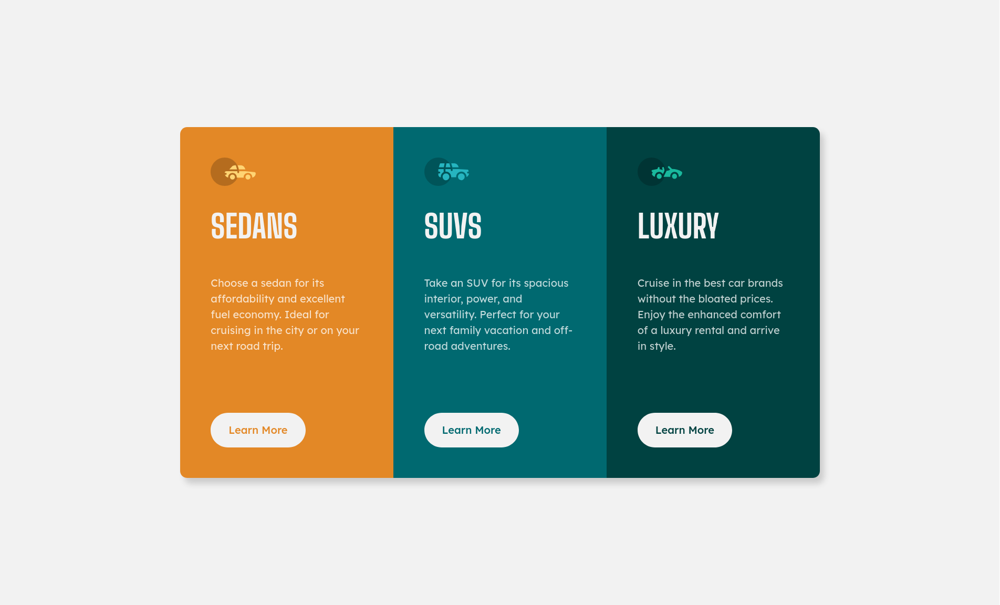

# Frontend Mentor - 3-column preview card component solution

This is a solution to the [3-column preview card component challenge on Frontend Mentor](https://www.frontendmentor.io/challenges/3column-preview-card-component-pH92eAR2-). I build it using html and css only.

## Table of contents

- [Overview](#overview)
  - [The challenge](#the-challenge)
  - [Screenshot](#screenshot)
  - [Links](#links)
- [My process](#my-process)
  - [Built with](#built-with)
  - [What I learned](#what-i-learned)
- [Author](#author)

## Overview

### The challenge

Users should be able to:

- View the optimal layout depending on their device's screen size
- See hover states for interactive elements

### Screenshot




### Links

- Solution URL: [code on github](https://github.com/r-yadav01/fm-3-column-preview-card-component)
- Live Site URL: [click here](https://r-yadav01.github.io/fm-3-column-preview-card-component)

## My process

### Built with

- Semantic HTML5 markup
- CSS custom properties
- Flexbox
- CSS Grid
- Mobile-first workflow

### What I learned

- By planning the html structure and css sprinking on paper first, before executing on the code makes the project execution a lot faster and smoother, because most of the things are planned before the code is being written.

- I learned a new trick using which I can trim the inner div's border corners which are popping out because the outer div has a border-radius by using `overflow: hidden` css property

```html
<div class="outer-div">
  <div class="inner-div">some text here</div>
</div>
```

```css
.outer-div {
  overflow: hidden;
}

.inner-div {
  height: 100%;
  width: 100%;
}
```

## Author

- Frontend Mentor - [@r-yadav01](https://www.frontendmentor.io/profile/r-yadav01)
- Twitter - [@r_yadav01](https://x.com/r_yadav01)
- GitHub - [r-yadav01](https://github.com/r-yadav01)
